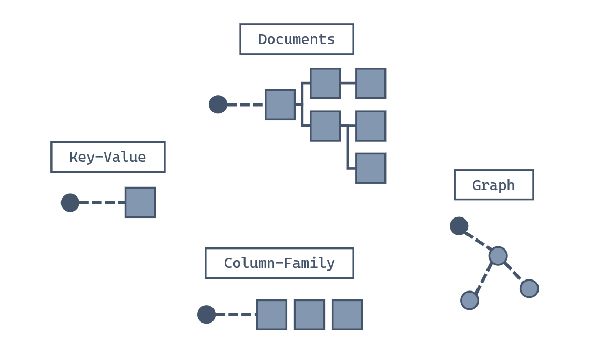
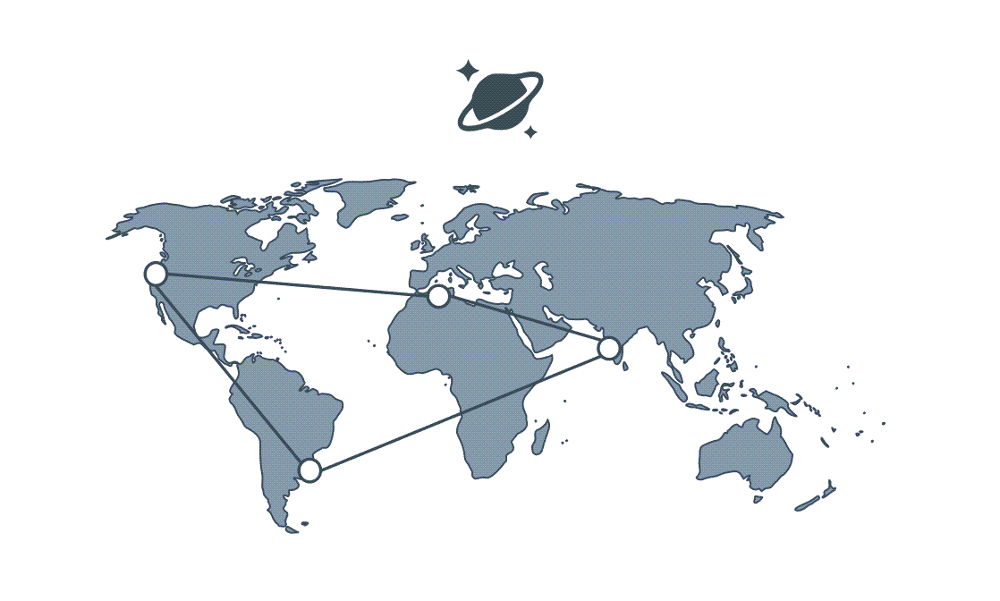
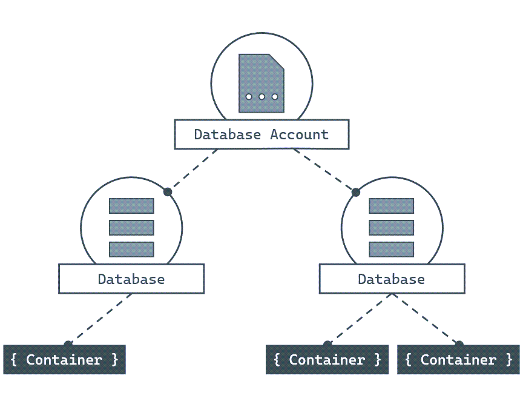
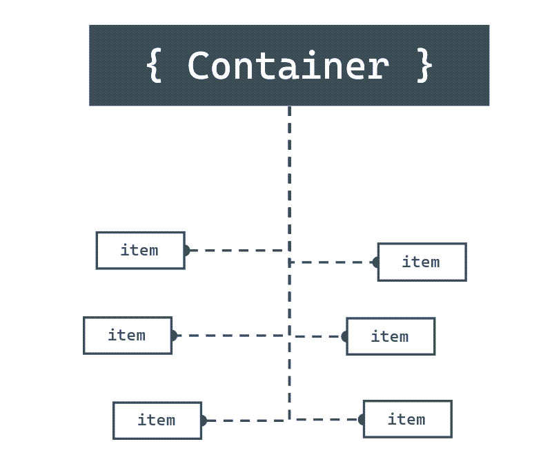
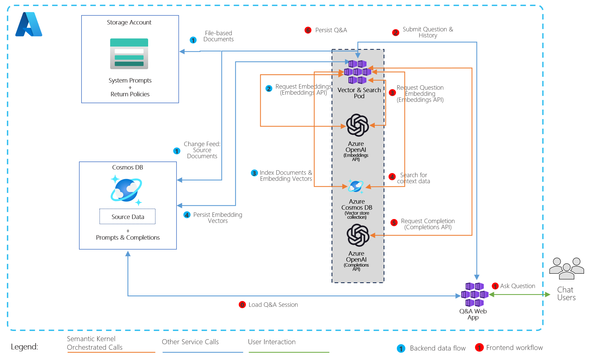
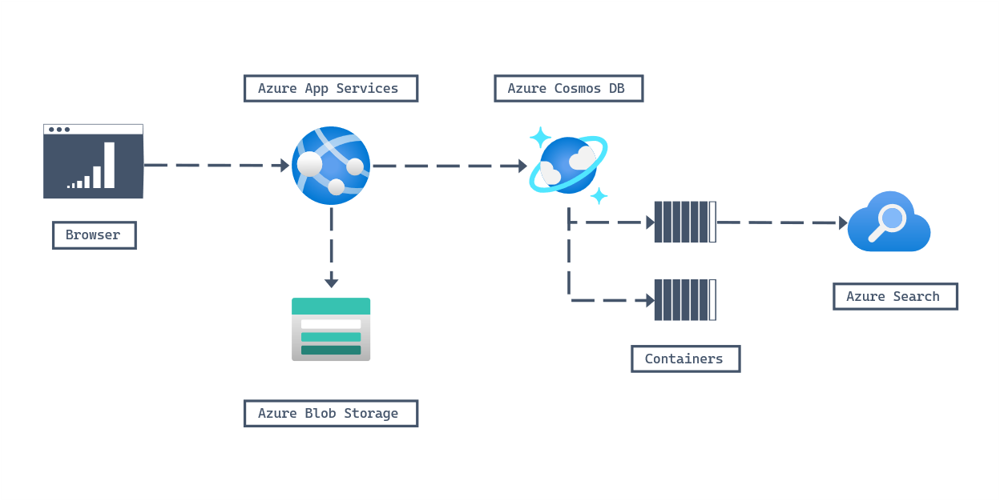
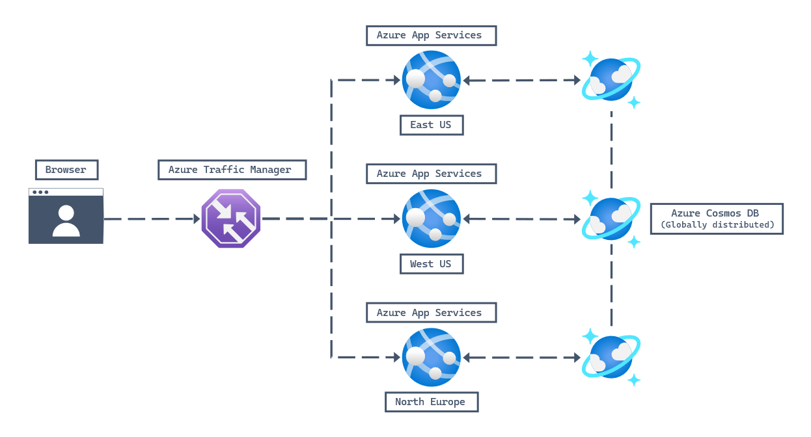
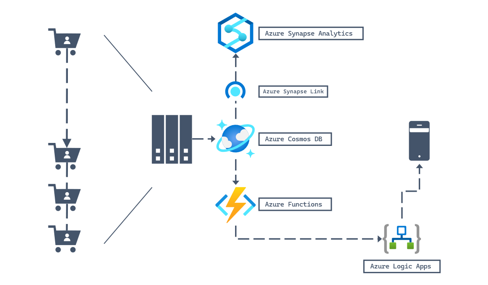
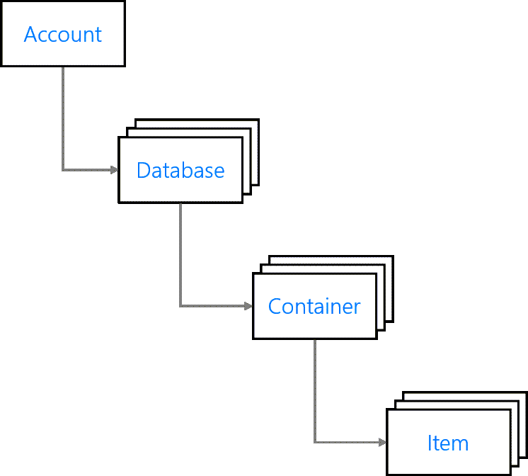

## Introduction to Azure Cosmos DB for NoSQL

### Introduction

Today’s applications need to work with real-time data, different data formats, high traffic, and changing business requirements.

Modern applications should be:

- resilient
- flexible
- scalable
- able to process real-time data
- ready for modern AI capabilities

Applications often receive data from many different sources. This data can have different shapes, different volumes, and different speeds. Because of this, developers need platforms that can adapt quickly when the business changes.

A flexible database platform helps developers build new features faster and handle changes in data volume, velocity, and structure.

### Scenario

Imagine that you are the lead developer at a retail company.

Your team is building a new online storefront. The application will use AI agents to help customers during their shopping experience. The storefront must work across different devices, including mobile devices.

When the storefront is published, the company expects a large traffic spike because of launch campaigns and sales.

As the lead developer, you need to choose a database platform.

The database should be able to handle:

- large amounts of data
- different types of data
- high-volume workloads
- high-velocity workloads
- sudden traffic growth
- fast scaling with little friction
- AI search scenarios with vectorized data

### Azure Cosmos DB

Azure Cosmos DB is a fast NoSQL database service for modern application development and AI application development at any scale.

In this module, the main goal is to understand how Azure Cosmos DB for NoSQL can solve this type of business problem.

After this section, I should be able to:

- evaluate whether Azure Cosmos DB for NoSQL is the right database for an application
- describe why Azure Cosmos DB for NoSQL is useful for modern applications

## What is Azure Cosmos DB for NoSQL
. Let's start with a few definitions and a quick tour through Azure Cosmos DB for NoSQL. This overview should help you see whether Azure Cosmos DB might be a good fit for your work.

### What is a NoSQL database?

Developers require new kinds of databases that can address the unique challenges of modern apps. NoSQL databases were designed to address needs such as:

- High volumes of data.
- Data with many different sources and forms.
- Dynamic data schemas that store different types of data.
- Using high-velocity and/or real-time data.

You define NoSQL databases by the common characteristics they share rather than by a specific formal definition. These characteristics include:

- A nonrelational data store.
- Being designed to scale out.
- Not enforcing a specific schema.

Generally, NoSQL databases don't enforce relational constraints or put locks on data, making writes fast. Also, they're often designed to horizontally scale via sharding or partitioning, which allows them to maintain high-performance regardless of size.

While there are many NoSQL data models, four broad data model families are commonly used when modeling data in a NoSQL database:



Moving forward, we focus on the data model supported by Azure Cosmos DB for NoSQL: The document data model.

### Why use a NoSQL database with the document data model?

The document data model breaks data down into individual document entities. A document can be any structured data type, but JSON is commonly used as the data format. The Azure Cosmos DB for NoSQL supports JSON natively. 


A document is an atomic entity and can have its own data form, regardless of what is stored in other documents in the same database. Because of this flexibility, there's no need for a predefined schema making it easier to build new applications rapidly. Additionally, this flexibility enables scenarios where different types of data can be stored together and where models can evolve over the lifetime of an application.

### What is a JSON document?

JavaScript Object Notation, or JSON, is a lightweight data format. JSON was built to be highly compatible with the literal notation of an object in the JavaScript language. Many frameworks, browsers, and even databases support JavaScript natively making JSON a popular format for transmitting and storing data.

Here's an example of a JSON document:

```json
{
  "device": {
    "type": "mobile"
  },
  "sentTime": "2019-11-12T13:08:42",
  "spoolRefs": [
    "6a86682c-be5a-4a4a-bacd-96c4d1c7ece6",
    "79e78fe2-93aa-4688-89db-a7278b034aa6"
  ]
}
```
As you can see, JSON is a relatively readable data format that clearly exposes its content. JSON is also relatively easy to parse and use in JavaScript applications.

### What is Azure Cosmos DB for NoSQL?
Azure Cosmos DB for NoSQL is a fast NoSQL and vector database service that offers rich querying over diverse data and supports a new generation of Generative AI applications. It helps deliver configurable and reliable performance, is globally distributed, and enables rapid development.




The NoSQL API is the core or native API for working with documents. The NoSQL API supports fast, flexible development utilizing JSON documents, a query language with a familiar syntax, and client libraries for popular programming languages. Azure Cosmos DB also provides unique capabilities such as vector indexing and search, allowing users to create a new breed of Generative AI applications over users' data that can rapidly scale efficiently.

Azure Cosmos DB for NoSQL has a few advantages such as:

- Industry Leading Vector Database with vector indexing and search designed to handle high-dimensional vectors, enabling efficient and accurate vector search at any scale.
- Guaranteed speed at any scale even through bursts—with instant, limitless elasticity, fast reads, and multi-master writes, anywhere in the world.
- Fast, flexible app development with SDKs for popular languages and frameworks such as .NET, Java, Python, JavaScript and GO, as well as no-ETL (extract, transform, load) analytics.
- Ready for mission-critical applications with guaranteed business continuity, 99.999-percent availability, and enterprise-grade security.
- Fully managed and cost-effective with a fully featured serverless offering as well as instant, automatic and dynamic scaling that responds to application needs.

These capabilities make Azure Cosmos DB ideally suited for modern application development. Azure Cosmos DB for NoSQL is especially suited for applications that:

- Experience unpredictable spikes and dips in traffic
- Generate lots of data
- Need to deliver real-time user experiences
- Are depended upon for business continuity

The Azure Cosmos DB for NoSQL can store native JSON documents with flexible schema. Data is indexed automatically and is available for query using a flavor of the SQL query language designed for JSON data. The NoSQL API can be accessed using SDKs for popular frameworks such as .NET, Python, Java, Node.js and GO.

### How does Azure Cosmos DB for NoSQL work
Now that we know the basics of Azure Cosmos DB, let's see what resources and information are required to start working with an account. This information should help you decide whether Azure Cosmos DB for NoSQL works for your data set. Also, it should help you decide how much, if any, extra configuration is necessary.

### What are the components of Azure Cosmos DB for NoSQL?
 To begin using Azure Cosmos DB, you first create various resources in Azure such as accounts, databases, containers, and items.



### Accounts
Accounts are the fundamental units of high availability and tenant isolation for SaaS applications. At the account level, you can configure the region[s] for your data in Azure Cosmos DB for NoSQL. Accounts also contain the globally unique DNS name used for API requests. You can also set the default consistency level for requests at the account level. You can manage or create accounts using the Azure portal, Azure Resource Manager templates, the Azure CLI, or Azure PowerShell.

### Databases 
Each account can contain one or more Databases. A database is a logical unit of management for containers in Azure Cosmos DB for NoSQL.

### Containers
Containers are the fundamental unit of scalability in Azure Cosmos DB for NoSQL. With Azure Cosmos DB, you provision throughput at the container level. You can also optionally configure an indexing policy or a default time-to-live value at the container level. Azure Cosmos DB for NoSQL will automatically and transparently partition the data in a container. 
### Items 
The NoSQL API for Azure Cosmos DB stores individual documents in JSON format as items within the container. Azure Cosmos DB for NoSQL natively supports JSON files and can provide fast and predictable performance because write operations on JSON documents are atomic.



### Partitioning & Partition Keys
Every Azure Cosmos DB for NoSQL container is required to specify a partition key path that is used to distribute data for scale out. Behind the scenes, Azure Cosmos DB for NoSQL uses this path to logically partition data using partition key values. For example, consider the following JSON document:

```json
{
  "id": "35b5bf7d-5f0e-4209-b7cb-8c5c70c3bb59",
  "deviceDisplayName": "shared-printer",
  "acquiredYear": 2019,
  "department": {
    "name": "information-technology",
    "metadata": {
      "location": "floor-5-unit-27"
    }
  },
  "queuedDocuments": [
    {
      "sender": "user-293749329",
      "sentTime": "2019-07-26T05:12:37",
      "pages": 5,
      "spoolRef": "3f4b759c-3230-4269-a88e-de7620ad91c0"
    },
    {
      "device": {
        "type": "mobile"
      },
      "sentTime": "2019-11-12T13:08:42",
      "spoolRefs": [
        "6a86682c-be5a-4a4a-bacd-96c4d1c7ece6",
        "79e78fe2-93aa-4688-89db-a7278b034aa6"
      ]
    }
  ]
}
```

If your container specifies a partition key path of /department/name, then the partition key value of this document would be information-technology. Behind the scenes, Azure Cosmos DB for NoSQL automatically manages the physical resources necessary to support your data workload.

Selecting a partition key path for a container is critical to allow applications to scale and is one of the most important design decisions for a new workload. Review the [choosing a partition key](https://learn.microsoft.com/en-us/azure/cosmos-db/partitioning#choose-partitionkey) documentation for a deeper technical explanation and best practices.


### When should you use Azure Cosmos DB for NoSQL


Azure Cosmos DB for NoSQL is a fully managed NoSQL database service for modern and AI app development. It provides guaranteed single-digit millisecond response times, 99.999-percent availability and [vector database capabilities](https://learn.microsoft.com/en-us/azure/cosmos-db/vector-database), backed by SLAs with automatic and instant scalability.

For enterprise scenarios, Azure Cosmos DB for NoSQL has a comprehensive suite of financially backed [service level agreements (SLAs)](https://learn.microsoft.com/en-us/azure/cosmos-db/vector-database) that cover throughput, consistency, availability, and latency.

###  Common use cases for the Azure Cosmos DB for NoSQL

As a fast NoSQL database with a flexible API and vector indexing and search capabilities, Azure Cosmos DB for NoSQL is well suited for many types and sizes of applications. From the very small scale, to high-performance applications with global ambition. Speed and flexibility make Azure Cosmos DB for NoSQL great for Generative AI, web, retail, IoT, gaming, and mobile applications. Azure Cosmos DB for NoSQL is a good fit for applications that require flexibility, low cost, fast response times, and the ability to scale to massive volume or velocity.

###  Generative AI
 Generative AI applications can be diverse and unpredictable. These workloads require a database platform that is cost-efficient, responsive and scalable. Users can store vectors directly in their documents with traditional schema-free data and high-dimensional vectors as other properties. This colocation of data and vectors allows for efficient indexing and searching, as the vectors are stored in the same logical unit as the data they represent. Keeping vectors and data together simplifies data management, AI application architectures, and the efficiency of vector-based operations. 
 


In this example, customers are taking transactional and operational data and vectorizing it to be used for vector search by multiple AI Agents serving customers. Azure Cosmos DB's Change Feed is used to handle ingestion and vectorization of new or updated data, making it available in near real-time for users. Customers interacting with these agents generate prompts and completions which are also stored as their chat history in Azure Comsos DB and used to provide a semantic cache for improved cost and performance.

### Retail/marketing

Azure Cosmos DB for NoSQL is a great fit for retail and marketing workloads that can experience dramatic and unexpected swings in usage at any point throughout the year. The elastic scale of Azure Cosmos DB for NoSQL ensures that the database platform can handle requests during peak usage, and save money during nonpeak times.



In this example, a JavaScript web application, built on content stored in Azure Blob Storage, uses Azure Cosmos DB for NoSQL as it's backing database. Multiple accounts are used to manage different facets of the solution such as the shopping cart, inventory, or catalog. The solution then uses Azure Search to index the Azure Cosmos DB for NoSQL data, providing a rich search experience to end users.

### Web/mobile
Many modern social applications generate a plethora of user-generated content that is diverse in quantity, shape, and volume. Azure Cosmos DB for NoSQL is a great candidate for this workload as this API can store data of varying schemas. Consider the NoSQL API for data that may have schemas that change or evolve over time as the company's initiatives expand into new areas.



In this example, a user is using a URL to access a web site in their browser. The URL points to Azure Traffic Manager, which then uses a built-in algorithm to determine which Azure App Service endpoint to redirect the user to. Since Azure Cosmos DB for NoSQL is capable of global distribution, you only need one account that is replicated across multiple regions.

### Module Scenario

Consider the scenario from the beginning of this module:

> Suppose you work as the lead developer at a retail company. Your team is building your online storefront with support for AI Agents to provide a rich experience for users. You're designing the new storefront to be accessible across various devices including mobile. The team expects a spike in demand when the storefront is published and various "grand opening" sales begin.

One key part of your store's success is the ability for the company to notify users of shipping updates regardless of what device they place the order on or are currently using. Your team has worked hard on a sophisticated system to manage detailed order status tracking. The tight integration of Azure Cosmos DB with other Azure services, let's you consider building solutions that use order data in Azure Cosmos DB for NoSQL to send notification to your user's mobile devices. The notifications alert them when their package ships, or is out for delivery.




This example is similar to the example from the introduction of this module. To build on the first example, your team has decided to introduce Azure Cosmos DB for NoSQL as the database of choice. Now, your team can use Azure Synapse Link to prepare and aggregate data for deeper analysis using Azure Synapse Analytics. Your team can also use services such as Azure Functions to react to data events with Azure Cosmos DB, and then trigger an Azure Logic Apps workflow that sends notifications to mobile devices.


 ### Try Azure Cosmos DB for NoSQL 

 ### Introduction
   The first step to getting started with Azure Cosmos DB is to create a new account. You will learn, here, the basic hierarchy of resources in an Azure Cosmos DB for NoSQL account and how   to create an account along with those resources.

After completing this module, you'll be able to:

Create a new Azure Cosmos DB for NoSQL account
Create database, container, and item resources for an Azure Cosmos DB for NoSQL account
 

### Explore resources
An Azure Cosmos DB for NoSQL account is composed of a basic hierarchy of resources that include:

- An account
- One or more databases
- One or more containers
- Many items




